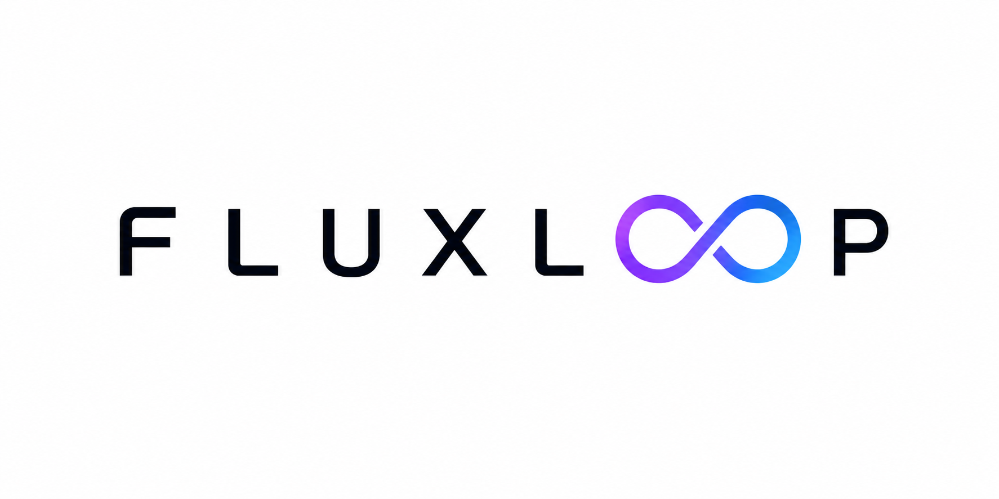

<p align="center">
  
</p>

<p align="center">
  <i>一个能自主接入未知硬件、学懂它的真实物理、并写出驱动的 AI 研究员。</i>
</p>

<p align="center">
  <b>开启「物理一人 / 几人 / 零人公司」时代——<br/>当 AI 包办物理研发，极小团队也能造出真实硬件。</b>
</p>

<p align="center">
  
  
  
</p>

<p align="center">
  | <a href="./README.md"><b>English</b></a> | <b>简体中文</b> |
</p>

<p align="center">
  <a href="#-概述">概述</a> • <a href="#-它做什么">它做什么</a> • <a href="#-一个值得讨论的命题">命题</a> • <a href="#-已构建并验证">证据</a> • <a href="#-产品阵容">产品</a> • <a href="#-一起来做">参与</a>
</p>

---

## 📌 概述

今天的 AI 能在几分钟里搭出一个 Web 应用。但把它丢给一个文档含糊、协议私有的真实电机，它就束手无策——因为**智能至今"碰不到"物理世界**。正是这最后一道缝，让每一个机器人和硬件团队悄悄损失掉数周时间。

**FLUXLOOP** 要补上这道缝。它是一个 agent-led 的硬件研发系统（open-core：组件开源，集成产品商业闭源）：给它任意一个作动器、传感器或设备——哪怕没有文档、协议私有、连厂家自己都说不清性能——FLUXLOOP 自主搞清楚怎么和它通信、标定出它真实的物理行为、并产出一个可用的驱动。专家要花几周才能做完的事（协议接入、sim2real 标定、驱动开发），它压缩到几小时。

整个系统围绕三层组织。**研究大脑**（[Flux-Insight](https://github.com/ExuberantWitness/Flux-Insight)）负责提假设、设计实验，并在"调参不够用"时通过符号回归**自主发现**新的修正模型。**精确物理世界**（[FLUXVortex](https://github.com/ExuberantWitness/FLUXVortex) 管气动、[FluxPhased](https://github.com/ExuberantWitness/FluxPhased-) 管电磁）从第一性原理算精确物理，而不是从数据里学近似。**实时安全躯体**（[FluxTendril](https://github.com/DataFlux-Robot/FluxTendril) + [FluxAxon](https://github.com/DataFlux-Robot/FluxAxon) + [FluxCurrent](https://github.com/DataFlux-Robot/FluxCurrent)）让 Agent 能真正去探测、驱动物理硬件——这是云端模型永远够不到的地方。

归根结底，它不是一个工具，而是一个**闭环**：FLUXLOOP 每接入一个设备，都会让它的物理模型更准，再反哺下一个。这个闭环，是通往一个更大目标的第一个具体步骤——**physical auto-research（物理自主研究）**：能自我研究、并最终自我进化的机器。

而这一路也在改变**谁**能造硬件。当 Agent 包办物理研发，一个人、甚至零个人的公司，也能交付真实的物理产品。这就是我们要开启的时代——**物理一人 / 几人 / 零人公司**。

## 🔧 它做什么

```
   Agent 提假设  →  求解器预测  →  探测真实硬件  →  标定 sim ↔ real
       ↑                                                   │
       └──────────  驱动 + 真实性能模型  ←──────────────────┘
                    （+ 专有修正数据，回流喂养）
```

给 FLUXLOOP 一个黑盒部件。它**探测**总线与协议，用第一性原理多物理场求解器**预测**行为，对真实设备**做实验**，**标定** sim2real 的差距——当调参不足以闭合时，自主发现新的修正项——最后产出可用驱动和一个验证过的性能模型。

对工程师来说，体验很简单：**插上那个未知的东西，几小时后拿回一个驱动，和关于"它到底怎么表现"的真相——不是几个月。**

## 🧠 一个值得讨论的命题

> **我们认为 sim2real 本质上是一个模型*发现*问题，而不是 domain randomization 问题。**
>
> 主流做法从海量数据里学近似物理，也继承了它的"physics slop"。我们反过来：从第一性原理算精确物理，再让 Agent *发现*那些把仿真拉回现实的修正项。在任何物理精度真正要紧的场景，第一性原理 + 学习出的残差，胜过数据驱动的 world model。
>
> 不同意？**[来开个 issue 跟我们吵。](https://github.com/DataFlux-Robot/FLUXLOOP/issues)**

## 📣 用户在告诉我们什么

这个问题不是我们拍脑袋想的——我们去跨硬件、嵌入式、机器人社区做了结构化倾听。一位开发者在争论"AI 对嵌入式是不是吹的"时，写下（原话）：

> *"不是模型笨，是它根本没'看'你的硬件。datasheet 靠 OCR 连寄存器位都读不准，原理图直接看不见，全靠 grep 把代码库一股脑塞进上下文，真正关键的那个寄存器配置反而被挤没了。所以你才会看到：能编译、0 警告，然后 HardFault 原地去世。裸机这种差一个 bit 就全盘皆输的场景，通用 agent 确实还没法打。"*

**这就是 FLUXLOOP 的整个命题——由一个不是我们的人说出来。** 我们读过的讨论里信号一致：痛点真实、现有 workaround 是手动的（人肉把 datasheet 和库喂给模型）、对"能接地硬件的 agent"的需求是存在的。

→ 完整市场信号、原话与方法：**[MARKET_VALIDATION.md](./MARKET_VALIDATION.md)**

## 🧩 已构建并验证

不是 PPT。每个组件都是跑得起来、且对标黄金标准验证过的仓库：

| 层 | 组件 | 是什么 | 证据 |
|---|---|---|---|
| 🧠 Mind | **[Flux-Insight](https://github.com/ExuberantWitness/Flux-Insight)** | 自主研究引擎——Claim-Chain 知识图谱 + 21 个可组合 Skills | v0.3.0，活跃 |
| 🌐 World | **[FLUXVortex](https://github.com/ExuberantWitness/FLUXVortex)** | 第一性原理**气动**求解器（GPU 涡方法） | Goland 颤振 **2.4% 误差**，97% Theodorsen |
| 🌐 World | **[FluxPhased](https://github.com/ExuberantWitness/FluxPhased-)** | **电磁 / 相控阵**多物理场仿真（IQ 级） | MATLAB 校验 **83/83**，~985 组扫描 |
| 🦾 Body | **[FluxTendril](https://github.com/DataFlux-Robot/FluxTendril)** | 实时神经系统：协议统一的 Actuator/Sensor Bridge + 硬件 root-of-trust | 架构中 |
| 🦾 Body | **[FluxAxon](https://github.com/DataFlux-Robot/FluxAxon)** | TSN-over-USB 确定性桥——把主机接入 DataFlux 神经系统 | 🌱 早期 |
| 🔌 Body | **[FluxCurrent](https://github.com/DataFlux-Robot/FluxCurrent)** · **[FluxPulse](https://github.com/DataFlux-Robot/FluxPulse)** | 供电与母线底座（GaN；交错式 / 双向） | v0 硬件 |
| 📦 Assets | **[FLUXmeme](https://github.com/DataFlux-Robot/FLUXmeme)** | 面向实体节点的自描述 **DevelopReady 资产**格式——一个节点一个文件：躯体 + 心智 + 日志 | v0.1 |

> **已验证的 MVP**：一个 Agent 自主读文档、驱动示波器 + 继电器、自己写出了驱动。

## 🎁 产品阵容

*我们的 roadmap，实体化——每一档既是能拿在手里的产品，也是通往 2040 愿景的一级台阶。*

每一档都跑同一个 **FLUXLOOP 大脑**（auto-research agent + 物理仿真）。变的是 **Agent 能感知和行动到什么程度**——阶梯从「使用研发库」→「读传感器」→「看硬件」→「移动着看」→「动手操作」→「设计它」逐级爬升。盒子负责实时控制与感知；重推理和多物理场仿真默认在云端运行（或用本地 AI 模块全本地跑）。

| 档位 | 增加什么 | 适合谁 | 起价 |
|---|---|---|---|
| 🧠 **Node Base** | **DevelopReady 资产库访问** + Agent + 云，无硬件 | 直接使用已研发器件模型 | ¥49 / $9 一次性买断 |
| ⚡ **Node Bridge** | 板载初始性能算力 + 云 API | maker、学生、价格敏感开发者（推理走云） | ¥1,999 / $289 |
| 📦 **Node Aware** | 板载中等性能边缘算力 | 已能通过传感器读到状态的硬件 | ¥5,999 / $849 |
| 📷 **Node Vision** | + 固定摄像头 · 多模态 | **无可读状态传感器**的硬件——摄像头成为虚拟传感器 | ¥6,999 / $989 |
| 🦾 **Node Explore** | + 可动臂摄像头 + 可调底座（类 [Kynooe](https://www.kynooe.com/)） | **主动感知**——Agent 换位置看被遮挡的状态 | ¥15,999 / $2,499 |
| 🔮 **Node Meta** | 模块化人形 → 自动设计模块 | 2040 愿景——**不发售**，仅 notify-me | — |
| 🔧 **本地 AI 模块** *(选配)* | 板载高性能算力——本地跑 LLM **和**多物理场仿真 | **数据不出端**的安全部署 | +¥5,999 / +$849 |

> *指示性早鸟价——最终档位、目标金额、发货与 demo 随众筹一起公布。`Node Meta` 是我们奔赴的愿景，明确标注、绝不在真东西之前预售。*

**命名哲学：** Base → Bridge → Aware → Vision → Explore → Meta。Base（基础思考）→ Bridge（桥接物理世界）→ Aware（感知状态）→ Vision（看见硬件）→ Explore（主动探索）→ Meta（自我设计）。

### 🧠 DevelopReady

NVIDIA 定义了 *SimReady*——能被仿真的资产。我们更进一步：能被**直接驱动、标定、部署**的资产。FLUXLOOP 每研究一个器件，产出的就是 DevelopReady 模型——不只是仿真数字孪生，而是可用的驱动、标定过的性能模型、以及过程中发现的专有修正项。这些资产以 [FLUXmeme](https://github.com/DataFlux-Robot/FLUXmeme) 自描述的 **DevelopReady 资产格式**打包——每个实体节点一个文件，携带它的躯体、心智与完整生命周期日志——让研究过的器件可迁移、可版本化、到处即插即用。

### 🌐 共享认知池

FLUXLOOP 每研究一个器件，产出的 DevelopReady 模型回流进共享认知池。用户 A 研究过的电机，成为用户 B 的认知起点——不需要从零开始。

**访问模型：**
- **一次性买断** → 可使用几个固定/预装模型
- **会员（¥49-199/月）** → 认知池全部读取；向公共池贡献包含在会员内
- **私有模型** → 额外付费（企业/保密需求）

这是数据飞轮：更多用户 → 更多器件模型 → 下一个用户上手更快 → 产品更有价值 → 更多用户。

### 🔄 自我喂养的闭环

> **我们用 FLUXLOOP 来开发 FLUXLOOP。** 每研究一个器件，系统就为所有人变得更敏锐。上线时：**200+ 器件模型已沉淀在池子里。**

我们自己是最挑剔的第一个用户——节点自主研究它触碰到的每一个器件（关节模组、传感器、执行器），将电子资产从 SimReady 推进到 DevelopReady。每个模型直接回流进共享认知池。我们的第一位支持者收到的不是空白系统——而是一个已经"读过"数百个器件的节点网络。

### ☁️ 云与定价 — 公道设计

默认盒子负责控制与感知，**重 LLM 推理和 GPU 多物理场仿真在云端跑**。我们的定价哲学：**三档、透明按量、不在 token 上加价。**

- **一次性买断（档位价格）** → 基础功能 + 几个固定认知池模型
- **会员 ¥49-199/月** → 完整求解器访问 + 认知池全部读取 + Agent 高级编排 + 向公共池贡献。**众筹档位包含 1 年会员。**
- **按量计费（透明）：**
  - **Token（LLM）** —— **官方 API 价 +3%**（近成本）
  - **GPU 算力（多物理场仿真）** —— **较低市场价**
- **私有模型存储** → 额外付费（企业/保密需求）

需要全部本地以满足安全？**本地 AI 模块**让整个闭环跑在你自己硬件上，**数据零出端**。

## ✅ 当前状态 — 诚实说

Phase 0 已交付。Phase 1 进行中：**电学闭环已通**（Agent → 探测 → 驱动），多物理场目前覆盖**气动 + 电磁**（热在路上）。端到端整合、以及未知协议自动发现的产品化，正在开发。Phase 2–4 是北极星。

**我们不假装已经到达终点。我们声明的是——每一步下面都有真实代码，而且我们把它亮出来。** 这就是全部的重点。

## ⏱️ 为什么是现在

六个门槛在过去 12 个月才同时跨过，缺一不可：

1. **软件被智能数倍加速，物理能力没有跟上。** 内部数据显示工程师借助智能工具代码产出已达数倍——但这个加速完全停留在软件侧。做物理验证还是传统工程师团队的活。
2. **Agent 第一次能碰硬件。** MCP/Skill 协议 + 专属硬件桥——Agent 第一次能从物理世界拿到真实数据。2024 下半年才跨过。
3. **物理仿真生态格局刚确定。** Isaac Lab / USD / [NVIDIA Newton](https://developer.nvidia.com/newton-physics) 在 2025 年确立了主流地位——标准化的物理底座已就位。
4. **Agent 第一次能做研究。** 自动研究已能产出 workshop 级论文——证明 Agent 能干中级工程师级研发。
5. **软件侧递归自迭代快速发展，物理侧是空白。** Agent 训练 Agent 已有真实成果，但"Agent 自主做物理研究"没人做。
6. **基座模型刚够强。** 能撑起"假设→实验→分析→修正"的多步自主闭环。

早一年，这事做不成。这是早期窗口。

## 🤝 一起来做

这是一块需要很多人的拼图，我们想要锋利的人加入。

- ⭐ 如果你也认为 physical AI 缺的是**接地（grounding）**而不是规模，**Star** 一下。
- 💬 **[Discussions](https://github.com/DataFlux-Robot/FLUXLOOP/discussions)** —— 来辩"sim2real 是模型发现"这个命题，或者告诉我们哪个黑盒硬件毁了你上个月。
- 🛠️ **贡献** —— 实时内核、多物理场、机器人控制、Agent 系统，各组件仓库都有 open issues。
- 🎁 **众筹（即将开始）** —— `Node Base`、`Node Bridge`、`Node Aware` 和 `Node Vision`（见[产品阵容](#-产品阵容)）最先上早期支持者计划。*（回报档位、价格、发货随上线公布——Watch 本仓库，第一时间通知。）*

## 🙏 致谢

- 感谢 **MiMo Orbit 100T Token 创造者激励计划** 为我们关键组件的开发提供算力资源。
- 感谢 **小米** 提供 **MiMo-V2.5-Pro-UltraSpeed** 内测支持。其 1000+ tps 的推理速度让 Agent 能在同样时间内并行探索数十条假设并自校验（如对黑盒器件做 Best-of-N 协议猜测），为我们验证系统可用性提供了重要支持。
- 感谢 **地心引力计划（D-Robotics Gravity Program，DGP）** 提供的技术支持。

## 📬 联系我们

**对一起开发、讨论想法、或投资感兴趣？** 欢迎联系。

<p align="center">
  <br/>
  <sub>扫码加微信，备注"FLUXLOOP投资 / FLUXLOOP开发 / FLUXLOOP讨论"</sub>
</p>

更喜欢 GitHub？开个 [issue](https://github.com/DataFlux-Robot/FLUXLOOP/issues) 或 [discussion](https://github.com/DataFlux-Robot/FLUXLOOP/discussions)。

---

<p align="center">
  <sub><b>FLUXLOOP</b> · 由 <b>DataFLUX Dynamics</b> 打造 · early · open-core<br/>
  <i>从自动研发一个硬件，走向能自我研究、自我进化的机器。</i></sub>
</p>
